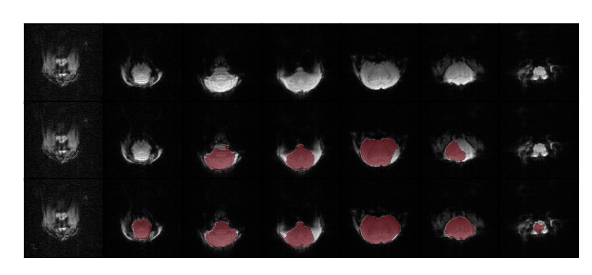
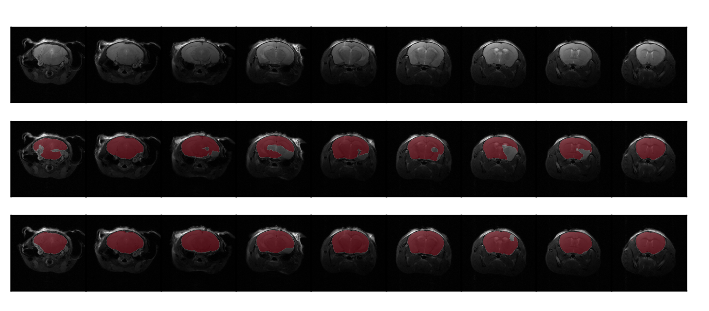
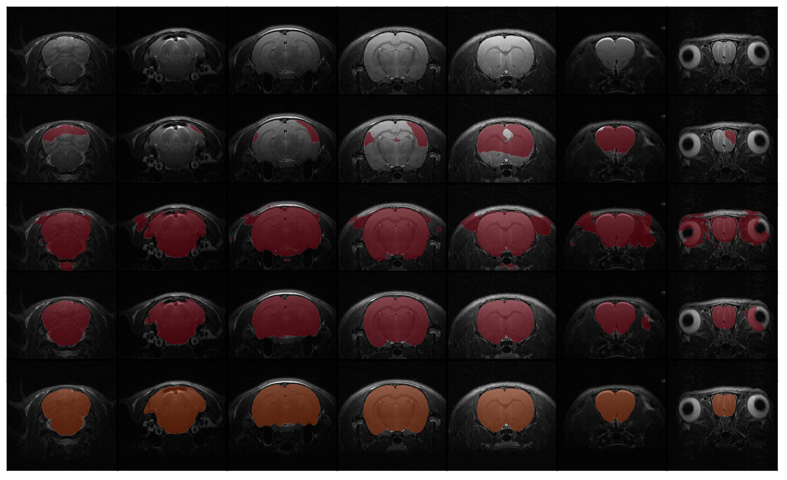
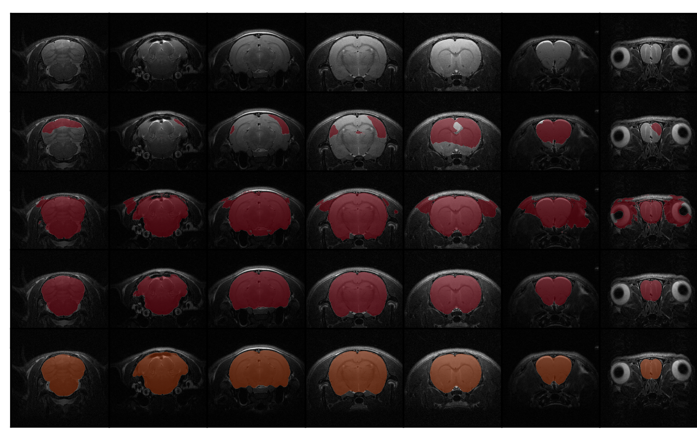

# BEN

BEN: a generalized Brain Extraction Net for multimodal MRI data from rodents, nonhuman primates, and humans

## Table of Contents

* [Installation](#installation)
* [Quick start / Tutorial](#quick-start)
    + [Cross modality](#cross-modality) [](https://colab.research.google.com/drive/14NWqdbkpsdt0cS4-SLCvcDmHLU05UlmV?usp=sharing)
    + [Cross field strength](#cross-field-strength) [](https://colab.research.google.com/drive/14NWqdbkpsdt0cS4-SLCvcDmHLU05UlmV?usp=sharing)
    + [Cross species](#cross-species)  [](https://colab.research.google.com/drive/1qsBg-_6NxVFUJCk0tbTyQ7vY8_FLnrc9?usp=sharing)
    + [Interface for neruoimaging toolboxes](#interface-for-neruoimaging-toolboxes)

+ [Other feature](#other-feature)
    + [Semi-supervised leaning](#semi-supervised-leaning)
    + [Quality assessment](#quality-assessment)

* [Data release](#data-release)
* [Notes](#Notes)

## Installation

An Nvidia GPU is needed for faster inference (less than 1s/scan on 1080ti gpu).

Requirements:

* tensorflow-gpu == 1.15.4
* Keras == 2.2.4
* numpy == 1.16
* simpleitk == 2.0
* opencv-python == 4.1
* matplotlib == 3.3.1

You need to download this repository and run following command:

```
cd path/to/repository/
pip install -r requirement.txt
```

The project folder looks like this:

```
path
│  BEN_tutorial_Ⅰ.py
│  BEN_tutorial_Ⅱ.py
│  README.md
│
├─weight
│  ├─unet_fp32_all_BN_NoCenterScale_polyic_epoch15_bottle256_04012056
│  └─unet_fp32_all_BN_NoCenterScale_polyic_epoch15_bottle256_04012051
│
├─data  (Path for target domain data. Download data from this repository or put your data here.)
│  ├─rat
│  │  ├─src
│  │  │      xxx.nii.gz
│  │  │
│  │  ├─label
│  │  └─     xxx.nii.gz
│  │
│  ├─epi
│  │  ├─src
│  │  └─     xxx.nii.gz
│  │
│  └─7T
│      ├─src
│      └─    xxx.nii.gz
│
├─utils
│
├─model
│
└─fig

```

## Quick Start

### Cross modality

#### Results:

1. Modality: T2WI -> EPI
2. For this exemplar domain adaptation (DA) task, No label is used (zero-shot).
3. From top raw to the third raw: Raw image, Baseline result, BEN's result.

   

### Cross field strength:

1. Field strength: 11.7 T -> 7 T
2. For this exemplar domain adaptation (DA) task, No label is used (zero-shot).
3. From top raw to the third raw: Raw image, Baseline result, BEN's result.

   

### Cross species:

1. Species: Mouse -> Rat
2. For this exemplar domain adaptation (DA) task, only ONE label is used.
3. The segmentation results are shown in red, the ground truth are shown in orange.
4. From top raw to the fifth raw: Raw image, Zero-shot (0 label used), finetune (1 label used), BEN's result (1 label
   used), Ground truth.

   

5. (Optional) Just do some simple postprocessing here, e.g., only save the top-K largest connected regions.
6. Compared with other methods, it further shows BEN's advantages

   

## Interface for neruoimaging toolboxes

| Name       | Link                             |
|------------|----------------------------------|
| AFNI       | afni.nimh.nih.gov/afni           |
| ANTs       | stnava.github.io/ANTs/           |
| FSL        | fsl.fmrib.ox.ac.uk/fsl/fslwiki   |
| FreeSurfer | freesurfer.net                   |
| SPM        | fil.ion.ucl.ac.uk/spm            |
| Nipype     | pypi.org/project/nipype/         |

(coming soon ...)

## Other feature

(to update)

### Semi-supervised leaning

### Quality assessment

# Data release

* For details about datasets, please refer to our paper.
* The scans used in our tutorial could be downlowd via link in Colab Notebook.
* The complete datasets will be released via [zenodo.org](https://zenodo.org/). Any additional data related to this
  paper can be requested from the authors.

# Notes

Acknowledgements: TODO

Disclaimer: This toolkit is only for research purpose.

