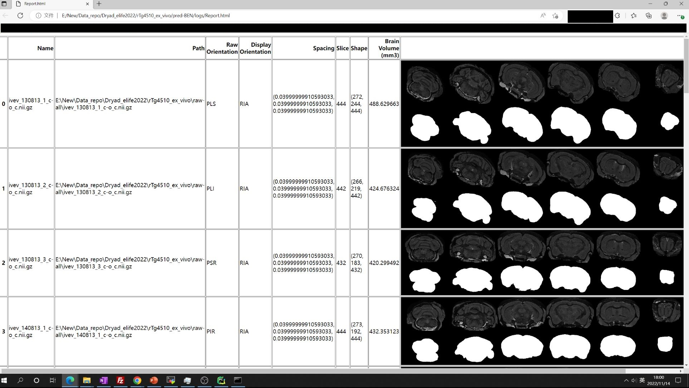
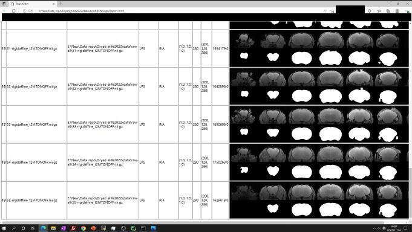
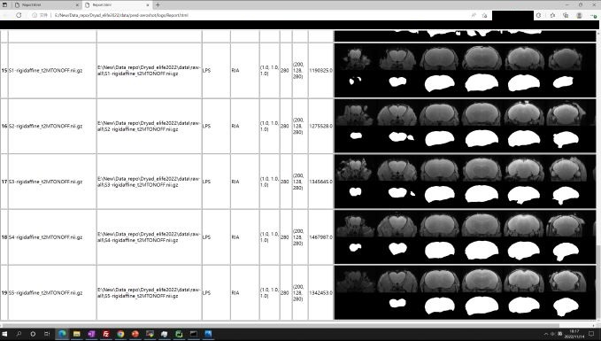

<div>

	<h1>BEN</h1>
<blockquote> A generalized Brain Extraction Net for multimodal MRI data from rodents, nonhuman primates, and humans
</blockquote>
</div>
<br />

<hr />


### [Paper](https://elifesciences.org/articles/81217) | [Feature](#feature) | [Replicate demo](#replicate-demo) | [MRI data release](/dataset_release) | [Pretrained weight](/dataset_release) | [Interface](/interface) | [Contributing to BEN](/dataset_release) | [Documentation](https://ben-docs.readthedocs.io/en/latest/)  | [Contents](#Quick-Start-Contents) | [Video tutorials](#Video-tutorials) 

[//]: # [biorxiv](https://www.biorxiv.org/content/10.1101/2022.05.25.492956v2.abstract)


See also:
 | [Github project link](https://github.com/yu02019/MouseGAN-pp)

```
Z. Yu, X. Han, S. Zhang, J. Feng, T. Peng and X. -Y. Zhang, "MouseGAN++: Unsupervised Disentanglement and Contrastive Representation for Multiple MRI Modalities Synthesis and Structural Segmentation of Mouse Brain," in IEEE Transactions on Medical Imaging, 2022, doi: 10.1109/TMI.2022.3225528.
```

---

## What's new in BEN (v0.2) ?
We release BEN (version 0.2) during November based on the reviewers' suggestions and our experiences accumulated in clinical practice.

(Old version is moved to 'doc' branch)

| New features                                                                                                  | Location                                   |
|---------------------------------------------------------------------------------------------------------------|--------------------------------------------|
| Add orientation detection (**Note:** if you want to run MR scans on the original orientation, don't set "-check" parameter in commands)                                                                            | [utils folder](/utils)                     |
| Add utils functions (some visualization and postprocessing functions)                                         | [utils folder](/utils)                     |
| Add Human-T1WI-HCP (baby) pretrained weight                                                                   | [dataset_release folder](/dataset_release) |
| Optimize BEN pipeline.                                                                                        | BEN_DA.py, BEN_infer.py                    |
| Visual (segmentation quality) and volumetric (brain volume) reports in automatically generated HTML web page. | [utils folder](/utils)                     |
| Video tutorials                                                                                               | [Video tutorials](#Video-tutorials)        |

### Near future plans in BEN v0.3
Please refer to [list](/utils#todo).

### Behind the work
Coincidentally, the motivation of BEN's training strategy is somewhat consistent with [Cellpose v2](https://www.nature.com/articles/s41592-022-01664-3#Sec5).
BEN tries to quickly develop a customized model specific to each user application with the help of the AdaBN module.

## Overview
🚀 Quick start to use BEN or replicate our experiments in 5 minutes!

### Feature


| Feature                       | Description                                                                                                                                                                                                           | Colab link                                                                                                                                                                                                                                                                                                                                                                                                                                                                                                                         |
|-------------------------------|-----------------------------------------------------------------------------------------------------------------------------------------------------------------------------------------------------------------------|------------------------------------------------------------------------------------------------------------------------------------------------------------------------------------------------------------------------------------------------------------------------------------------------------------------------------------------------------------------------------------------------------------------------------------------------------------------------------------------------------------------------------------|
| Transferability & flexibility | BEN outperforms traditional SOTA methods and advantageously adapts to datasets from diverse domains across multiple species [1], modalities [2], and MR scanners with different field strengths [3].                  | [1] [](https://colab.research.google.com/drive/1qsBg-_6NxVFUJCk0tbTyQ7vY8_FLnrc9?usp=sharing)<br/> [2] [](https://colab.research.google.com/drive/14NWqdbkpsdt0cS4-SLCvcDmHLU05UlmV?usp=sharing) <br/> [3] [](https://colab.research.google.com/drive/1xrREREKEs0HvDvhxA0sGCLsIdAFNLd2w?usp=sharing) |
| Quality assessment            | Unlike traditional toolboxes, which mainly rely on manual inspection to assess the brain extraction quality, BEN incorporates a quality assessment module to automatically evaluate its brain extraction performance. | [](https://colab.research.google.com/drive/1MMglzvMXC8YHI58vSQbi7VbHl5xsBpKN?usp=sharing)                                                                                                                                                                                                                                                                                                                                                                |
| Speed 🚀                      | Inference: Less than 1 sec/scan;<br/>Adaptation to a new imaging center/application: About 10 min for deployment.                                                                                                     | -                                                                                                                                                                                                                                                                                                                                                                                                                                                                                                                                  |


### Replicate demo
 

| Name                                                    | Description                                                                                                                                                   | Related Fig.<br/> in paper | Snapshot                                                                                                  | Colab link                                                                                                                                                                                                                                                                                                                                                                                        |
|---------------------------------------------------------|---------------------------------------------------------------------------------------------------------------------------------------------------------------|----------------------------|-----------------------------------------------------------------------------------------------------------|---------------------------------------------------------------------------------------------------------------------------------------------------------------------------------------------------------------------------------------------------------------------------------------------------------------------------------------------------------------------------------------------------|
| 1. BEN workflow & architecture                          | BEN renovates the brain extraction workflow to adapt to multiple species, modalities and platforms                                                            | Fig. 1 & 2                 |                | This repository                                                                                                                                                                                                                                                                                                                                                                                   |
| 2. ✨ Cross species                                      | Deploying BEN to new species requires minimal or even no labels.                                                                                              | Fig. 3                     |  | Cross species [](https://colab.research.google.com/drive/1qsBg-_6NxVFUJCk0tbTyQ7vY8_FLnrc9?usp=sharing)                                                                                                                                                                                                                 |
| 3. Cross modalities / MR scanners                       | Deploying BEN to new modalities/MR platforms requires minimal or even no labels.                                                                              | Fig. S1 & S2               |         | Cross modalities [](https://colab.research.google.com/drive/14NWqdbkpsdt0cS4-SLCvcDmHLU05UlmV?usp=sharing) <br/> Cross MR scanners [](https://colab.research.google.com/drive/1xrREREKEs0HvDvhxA0sGCLsIdAFNLd2w?usp=sharing)                  |
| 4. Compare with other toolbox                           | BEN outperforms traditional SOTA methods and advantageously adapts to datasets from various domains across multiple species, modalities, and field strengths. | Fig. 4                     |                | [](https://colab.research.google.com/drive/1HgHgqli-mVuIj9QolJ85KEB8LJcgN5qh?usp=sharing)                                                                                                                                                                                                                               |
| 5. Uncertainty & inter-rater variations                 | Compared to traditional toolboxes, BEN provides a measure of uncertainty that potentially reflects rater disagreement                                         | Fig. 5                     |                | Disagree map [](https://colab.research.google.com/drive/1xPVzA_FrZN1pI3l7fFRBlCNsRAEwQ0gG?usp=sharing)<br/> Uncertainty [](https://colab.research.google.com/drive/1MMglzvMXC8YHI58vSQbi7VbHl5xsBpKN?usp=sharing)                             |
| 6. ✨ Volumetric quantification for longitudinal studies | BEN improves the accuracy of atlas registration and benefits brain volumetric quantification compared with using other toolbox.                               | Fig. 6 & 7                 |                | Registration comparision [](https://colab.research.google.com/drive/1mnlBcRBxpLb2QbcVqQsU5p50fRaM5Ifq?usp=sharing)  <br/> Volumetric quantification [](https://colab.research.google.com/drive/13oZcuAsJ4yQcZ5jGl5kYNV3DlW-eFgVB?usp=sharing) |


### MRI data release | pretrained weight

The details can be found in this [folder](/dataset_release).


---
## Quick Start Contents

Visit our [documentation](https://ben-docs.readthedocs.io/en/latest/) or [video tutorials](#video-tutorials) for installation, tutorials and more.

* [Installation](#installation)
* [Quick Start / Tutorial](#quick-start)
    + [Cross modalities](#cross-modality) [](https://colab.research.google.com/drive/14NWqdbkpsdt0cS4-SLCvcDmHLU05UlmV?usp=sharing)
    + [Cross MR scanner with different field strengths](#cross_MR_scanner_with_different_field_strengths) [](https://colab.research.google.com/drive/1xrREREKEs0HvDvhxA0sGCLsIdAFNLd2w?usp=sharing)
    + [Cross species](#cross-species)  [](https://colab.research.google.com/drive/1qsBg-_6NxVFUJCk0tbTyQ7vY8_FLnrc9?usp=sharing)
    + [Try your data](#try-your-data)  [](https://colab.research.google.com/drive/1tfPfHg0Artjb2Ob8F_l9oOWb8u3y0lzi?usp=sharing)
    + [Video tutorials](#video-tutorials)
* [Resources](#resources)
  * [Interface for neruoimaging toolboxes](#interface-for-neruoimaging-toolboxes)
  * [Data release](/dataset_release)
  * [Pretained weight](/dataset_release)
  * [Contributing to BEN](/dataset_release)


## Installation

An Nvidia GPU is needed for faster inference (less than 1 sec/scan on 1080ti gpu).

Requirements:

* tensorflow-gpu == 1.15.4
* Keras == 2.2.4
* numpy == 1.16
* SimpleITK == 2.0
* opencv-python == 4.1
* scikit-image == 0.16.2

[//]: # (* matplotlib == 3.3.1)

Install dependencies:


```shell
git clone https://github.com/yu02019/BEN.git
cd BEN
pip install -r requirement.txt
```

The target domain data folder looks like this: (Download data from this repository/Colab or put your data here.)


## Quick Start

* All the undermentioned results can be repeated via our tutorial Notebook.
* New weight will be saved independently for further customized application.

### Cross modalities

#### Results:

1. Modality: T2WI -> EPI
2. For this exemplar domain adaptation (DA) task, No label is used (zero-shot).
3. From top row to the third row: Raw image, Baseline result, BEN's result.

   

### Cross MR scanner with different field strengths

1. MR scanner with different field strengths: 11.7 T -> 7 T
2. For this exemplar domain adaptation (DA) task, No label is used (zero-shot).
3. From top row to the third row: Raw image, Baseline result, BEN's result.

   

### Cross species

1. Species: Mouse -> Rat
2. For this exemplar domain adaptation (DA) task, only ONE label is used.
3. The segmentation results are shown in red, the ground truth are shown in orange.
4. From top row to the fifth row: Raw image, Zero-shot (0 label used), finetune (1 label used), BEN's result (1 label
   used), Ground truth.

   

5. (Optional) Just do some simple postprocessing here, e.g., only save the top-K largest connected regions.
6. Compared with other methods, it further shows BEN's advantages

   

## Try your data

Feel free to try your data or deploy BEN to your preprocessing pipeline. Details can be found in [notebook](https://colab.research.google.com/drive/1tfPfHg0Artjb2Ob8F_l9oOWb8u3y0lzi?usp=sharing) and video tutorials.
Pretrained weights can be found in [dataset_release](/dataset_release).

```shell
# Update BEN (domain adaptation)
python BEN_DA.py -t train_folder -l label_folder -r raw_image_folder -weight pretrained_weight_path -prefix new_model_name -check check_orientation
# Run inference
python BEN_infer.py -i input_folder -o output_folder -weight model_weight_path -check check_orientation
```

## Video tutorials
To further validate BEN’s generalization, we have evaluated BEN on two new external public ex-vivo MRI datasets ([rTg4510 mouse](https://github.com/dama-lab/mouse-brain-atlas/tree/master/rTg4510/rTg4510_ex_vivo): 25 ex-vivo scans, and [C57BL/6 mouse](https://datadryad.org/stash/dataset/doi:10.5061/dryad.1vhhmgqv8): 15 ex-vivo scans). When only one label is used for BEN adaptation/retraining, impressive performance is achieved on both datasets, despite the fact that BEN was originally designed for in-vivo MRI data.


| Dataset                                                                                            | Used label         | Description                                                                                                                                                                                                                | Automatically generated reports      | Video link                              |
|----------------------------------------------------------------------------------------------------|--------------------|----------------------------------------------------------------------------------------------------------------------------------------------------------------------------------------------------------------------------|--------------------------------------|-----------------------------------------|
| [rTg4510 mouse](https://github.com/dama-lab/mouse-brain-atlas/tree/master/rTg4510/rTg4510_ex_vivo) | 1                  | Ex-vivo scans with obvious distortion and different orientations.                                                                                                                                                          |           | [youtube](https://youtu.be/VZFNDh3MliA) |
| [C57BL/6 mouse](https://datadryad.org/stash/dataset/doi:10.5061/dryad.1vhhmgqv8)                   | 1                  | Ex-vivo scans. There is no obvious gap between the brain and the skull borderlines, making the task difficult.                                                                                                             |           | [youtube](https://youtu.be/K0HYknQnCrI) |
| [C57BL/6 mouse](https://datadryad.org/stash/dataset/doi:10.5061/dryad.1vhhmgqv8)                   | 0 <br/>(zero-shot) | Ex-vivo scans. The domain gap exists in ex-vivo MRI data and in-vivo images in our training images could be so large that it compromises the performance. In this case, we suggest users add several labels to update BEN. |  | [youtube](https://youtu.be/K0HYknQnCrI) |

Pretrained weight used in tutorials can download from [Google Drive](https://drive.google.com/file/d/1K5qIe6o8uG7cw_Uu0H3aB0FE40YXb9Hp/view?usp=share_link)

# Resources

##  Interface for neruoimaging toolboxes

The usages and details can be found in this [folder](/interface).

| Name       | Link                             |
|------------|----------------------------------|
| AFNI       | afni.nimh.nih.gov/afni           |
| ANTs       | stnava.github.io/ANTs/           |
| FSL        | fsl.fmrib.ox.ac.uk/fsl/fslwiki   |
| FreeSurfer | freesurfer.net                   |
| SPM        | fil.ion.ucl.ac.uk/spm            |
| Nipype     | pypi.org/project/nipype/         |


## Data release / Pretrained weight / Contributing to BEN

The details can be found in this [folder](/dataset_release).


---


# Citation
If you find our work / datasets / pretrained models useful for your research, please consider citing:

```bibtex
@article{yu2022generalizable,
  title={A generalizable brain extraction net (BEN) for multimodal MRI data from rodents, nonhuman primates, and humans},
  author={Yu, Ziqi and Han, Xiaoyang and Xu, Wenjing and Zhang, Jie and Marr, Carsten and Shen, Dinggang and Peng, Tingying and Zhang, Xiao-Yong and Feng, Jianfeng},
  journal={Elife},
  volume={11},
  pages={e81217},
  year={2022},
  publisher={eLife Sciences Publications Limited}
}
```

```bibtex
@dataset{yu_ziqi_2022_6844489,
  author       = {Yu Ziqi and
                  Xu Wenjing and
                  Zhang Xiao-Yong},
  title        = {{A longitudinal MRI dataset of young adult C57BL6J 
                   mouse brain}},
  month        = jul,
  year         = 2022,
  publisher    = {Zenodo},
  doi          = {10.5281/zenodo.6844489},
  url          = {https://doi.org/10.5281/zenodo.6844489}
}
```


[//]: # (Acknowledgements: TODO)

Disclaimer: This toolkit is only for research purpose.

