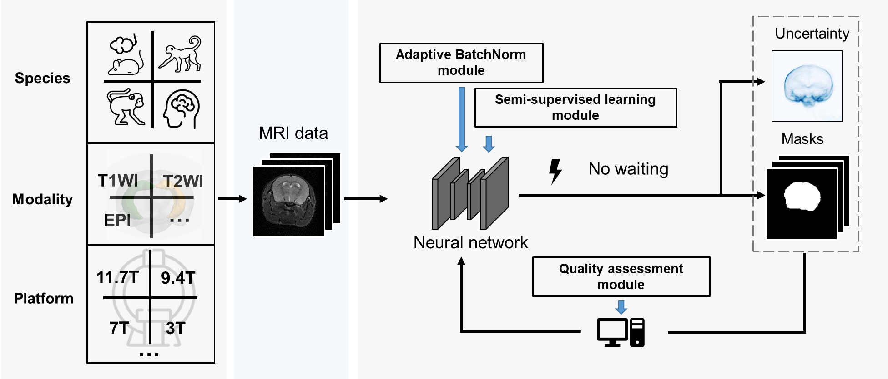

.. BEN documentation master file, created by
   sphinx-quickstart on Thu Jul 21 16:59:24 2022.
   You can adapt this file completely to your liking, but it should at least
   contain the root `toctree` directive.

|Docs|

BEN
=======

**A generalized Brain Extraction Net for multimodal MRI data from rodents, nonhuman primates, and humans.**

:mod:`BEN` is a domain-adaptive and semi-supervised deep neural network, to extract brain
tissues across species, MRI modalities, and MR scanners. Compared to conventional toolboxes,
the superiority of :mod:`BEN` is illustrated by its robustness, accuracy, and generalizability.
Our proposed method not only provides a generalized solution
for extracting brain tissue across species but also significantly improves the accuracy of atlas registration,
thereby benefiting the downstream processing tasks. As a novel fully automated deep-learning method,
:mod:`BEN` is designed as an `open-source software <https://github.com/yu02019/BEN/>`_ to enable high-throughput processing of neuroimaging data across species in preclinical and clinical applications.

.. Statement on updated algorith, GPU acceleration when available

Manuscript
----------

Please see the `manuscript <https://www.biorxiv.org/content/10.1101/2022.05.25.492956v2.abstract>`_ in *biorxiv* to learn more.

Getting started with BEN
-----------------------
Browse  tutorials and usages.

Contributing to BEN
-----------------------

We are happy about any contributions! (MRI data / trained weight / plug-in function code)

BEN follows the open-access paradigm, allowing users to save their updated models and share their weights for use by the neuroimaging community.

Besides, the accumulation of additional imaging data will further improve the performance of BEN and support the exploration of complex neuroimaging research.

If you have any suggestions, feel free to contact our corresponding author.

.. toctree::
   :caption: General
   :maxdepth: 2
   :hidden:

   installation
   feature
   api
   release_notes
..   contributors    .. todo update
..   contributing    .. todo update

.. toctree::
   :caption: Gallery
   :maxdepth: 2
   :hidden:

   tutorials

.. toctree::
   :caption: Resource
   :maxdepth: 2
   :hidden:

   mri_data_release
   pretrained_weight
   interface

.. Indices and tables
.. ==================

.. * :ref:`genindex`
.. * :ref:`modindex`
.. * :ref:`search`

.. |Docs| image:: https://img.shields.io/readthedocs/ben-docs
    :target: https://ben-docs.readthedocs.io/en/latest/
    :alt: Documentation

