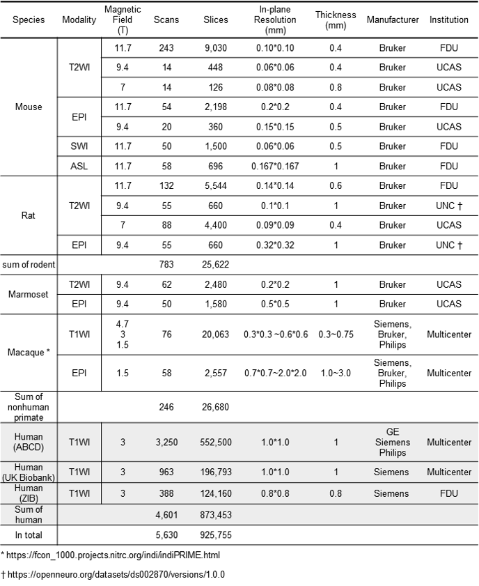

MRI dataset release
===================

The dataset used in our paper (Table. S1)

How to download/access the dataset
----------------------------------

.. list-table::
   :header-rows: 1

   * - Name
     - Access link
   * - Mouse-T2WI-11.7T
     - `Zenodo <https://doi.org/10.5281/zenodo.6844489>`_
   * - Rat-T2WI-9.4T
     - `CAMRI <https://openneuro.org/datasets/ds002870/versions/1.0.0>`_
   * - Rat-EPI-9.4T
     - `CAMRI <https://openneuro.org/datasets/ds002870/versions/1.0.0>`_
   * - Macaque-T1WI
     - `PRIME-DE <https://fcon_1000.projects.nitrc.org/indi/indiPRIME.html>`_
   * - Macaque-EPI
     - `PRIME-DE <https://fcon_1000.projects.nitrc.org/indi/indiPRIME.html>`_
   * - Human-ABCD
     - `ABCD Study <https://abcdstudy.org/>`_
   * - Human-UKB
     - `UK Biobank <https://www.ukbiobank.ac.uk/>`_
   * - Others
     - Available upon request

Note:

* For details about datasets, please refer to our `paper <https://www.biorxiv.org/content/10.1101/2022.05.25.492956v2.abstract>`_.
* The scans used in our tutorial could be downlowd via link in Colab Notebook.
* Any additional data used in this paper can be requested from the corresponding author.
